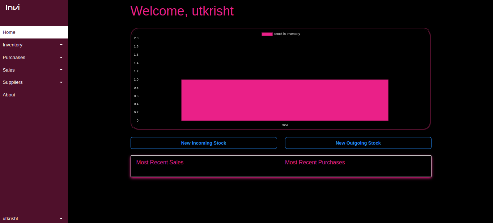
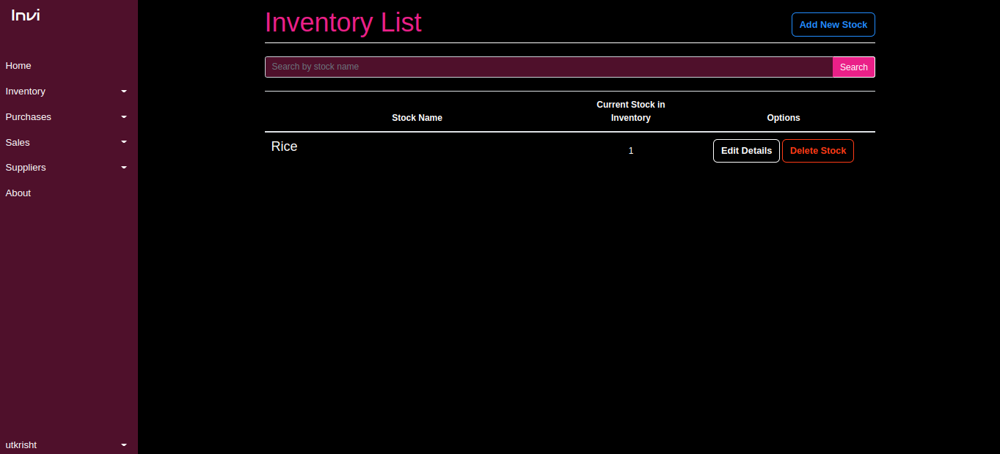

# Order_Management_System

## Run the following commands in the project's directory to create the database
```
python manage.py makemigrations homepage
python manage.py migrate homepage
python manage.py makemigrations inventory
python manage.py migrate inventory
python manage.py makemigrations transactions
python manage.py migrate transactions
```
## After the first time, the following can be run to migrate model changes in any app
```
python manage.py makemigrations
python manage.py migrate
```

## Use the following command to create an admin user 
```
python manage.py createsuperuser
```

## Use the following command to run the server
```
python manage.py runserver
```
## Output




